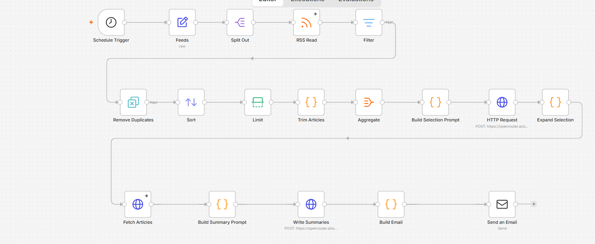

# Daily News Digest

Runs at 8pm every day. Reads 7 RSS feeds, picks the most important stock market
and AI stories from the last 24 hours, summarises them, and emails a plain-text
briefing.



Example output:

```
DAILY BRIEF
Saturday, October 31  |  10 stories
============================================================

MARKETS
------------------------------------------------------------

1. Apple faces $5.7 billion patent infringement verdict

   A federal jury awarded Taction Technology more than $5.7
   billion after finding Apple infringed claims from two
   haptics patents covering the iPhone and Apple Watch.

   https://...
```

## How it works

```
Schedule Trigger (8pm)
  → Feeds              list of 7 RSS URLs
  → Split Out          1 item per feed
  → RSS Read           runs once per feed, ~130 articles
  → Filter             last 24 hours only
  → Remove Duplicates  by title
  → Sort + Limit       newest first, capped at 250
  → Trim Articles      keep 5 fields, add an id
  → Aggregate          130 items into 1
  → AI call 1          picks the top 10, returns ids
  → Expand Selection   ids back into 10 items
  → Fetch Articles     fetches each page via r.jina.ai
  → Build Summary Prompt
  → AI call 2          writes the summaries
  → Build Email
  → Send Email
```

**Why two AI calls.** The first one reads 130 headlines and picks 10. The second
reads those 10 full articles and writes the summaries. They can't be merged
because the article fetch happens between them, and fetching all 130 would be
slow and expensive.

**Why `r.jina.ai`.** It fetches a page and returns clean markdown instead of raw
HTML, so no HTML stripping is needed. Free tier works for 10 requests a day.

**Fallback.** If an article can't be fetched, the summary is written from the RSS
snippet instead and kept to 2 sentences rather than padded out. `fullTextCount`
in the Build Summary Prompt output shows how many fetches succeeded.

## Setup

**1. Import** `workflow.json`.

**2. Set the timezone.** Workflow Settings → Timezone. n8n defaults to UTC, so
without this the 8pm trigger fires at the wrong time.

**3. Create two credentials:**

| Type | Field `Name` | Field `Value` |
|---|---|---|
| Header Auth | `Authorization` | `Bearer sk-or-v1-...` |
| SMTP | see below | |

SMTP settings for Gmail:

| Field | Value |
|---|---|
| User | your Gmail address |
| Password | 16-character app password ([generate here](https://myaccount.google.com/apppasswords)) |
| Host | `smtp.gmail.com` |
| Port | `465` |
| SSL/TLS | on |

App passwords need 2-Step Verification enabled first. Your normal Gmail password
won't work.

**4. Set your email address** in the Send an Email node. Both From and To are set
to `you@example.com` in this repo.

**5. Activate the workflow** with the toggle at the top right. Manual runs don't
schedule anything.

## Feeds

Edit the `Feeds` node to change these.

| Source | URL |
|---|---|
| MarketWatch | `https://feeds.content.dowjones.io/public/rss/mw_topstories` |
| Yahoo Finance | `https://finance.yahoo.com/news/rssindex` |
| CNBC | `https://search.cnbc.com/rs/search/combinedcms/view.xml?partnerId=wrss01&id=100003114` |
| Seeking Alpha | `https://seekingalpha.com/market_currents.xml` |
| Investing.com | `https://www.investing.com/rss/news.rss` |
| TechCrunch AI | `https://techcrunch.com/category/artificial-intelligence/feed/` |
| Hacker News | `https://hnrss.org/frontpage?points=200` |

RSS Read has On Error set to Continue, so one dead feed doesn't stop the run.

## Editing the prompts

Both prompts live in Code nodes, also copied to `code/` for reading on GitHub.

- `code/build-selection-prompt.js` — which stories get picked
- `code/build-summary-prompt.js` — how they're summarised

`workflow.json` is the source of truth. The files in `code/` are extracted
copies, regenerated with:

```bash
node extract.js "../Daily News Digest.json"
```

## Notes

- The model sometimes returns JSON wrapped in a ```` ```json ```` fence even with
  `response_format: json_object` set. Both parsing nodes strip it before parsing.
- Article URLs are sent to `r.jina.ai`, a third-party service.
- Two articles covering the same event from different angles occasionally both
  get selected. The selection prompt has a rule against this but it isn't perfect.
