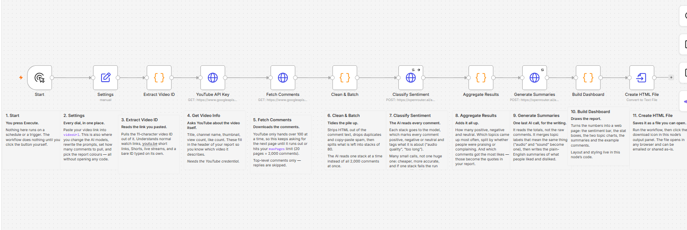

# YouTube Comment Sentiment Analysis

Paste a YouTube link, get an HTML dashboard showing how the audience received the
video. Tested from 7 to 2,400 comments.



[`sample-report.html`](sample-report.html) is real output from the test harness.
Download it and open in a browser.

The report contains:

- Total analysed, plus positive / neutral / negative counts and shares
- A diverging bar showing the sentiment split
- Ranked charts of what viewers praised and criticised
- Written summaries for each sentiment
- The most-liked comments as supporting quotes
- A table of all aspect counts

## How it works

```
Settings              paste your link here
  → Extract Video ID  handles watch, youtu.be, /shorts/, /live/ links
  → Get Video Info    title, channel, view count
  → Fetch Comments    100 per page, paginated
  → Clean & Batch     strip HTML, dedupe, split into batches of 80
  → Classify Sentiment  one AI call per batch
  → Aggregate Results   counts and aspect tallies
  → Generate Summaries  one AI call on the totals
  → Build Dashboard     builds the HTML
  → Create HTML File    downloadable report
```

**Why batching.** 2,000 comments don't fit usefully in one prompt, and accuracy
drops well before the context limit. Batches of 80 go to a cheap model (Haiku),
then one call to a stronger model (Sonnet) writes the summaries from the
aggregated counts rather than the raw comments. About $0.05 per 2,000-comment run.

**Error handling.** A failed batch is skipped and reported in the report footer
rather than stopping the run. JSON wrapped in a code fence is recovered. Comment
text is HTML-escaped so it can't inject markup into the report.

## Setup

**1. Import** `workflow.json`.

**2. Create two credentials:**

| Type | Name it | Field `Name` | Field `Value` |
|---|---|---|---|
| Query Auth | `YouTube API Key` | `key` | your YouTube Data API v3 key |
| Header Auth | `OpenRouter` | `Authorization` | `Bearer sk-or-v1-...` |

A YouTube key is free: [Google Cloud Console](https://console.cloud.google.com) →
new project → enable "YouTube Data API v3" → Credentials → API key.

**3. Select them** on the HTTP nodes. YouTube credential on `Get Video Info` and
`Fetch Comments`, OpenRouter on `Classify Sentiment` and `Generate Summaries`.

**4. Open the Settings node**, paste your link into `videoUrl`, run it.

## Settings

Everything is configurable from the `Settings` node. No need to open a Code node.

| Group | Fields |
|---|---|
| Input | `videoUrl`, `maxPages`, `commentOrder` |
| Batching | `batchSize`, `maxCommentLength` |
| Classification | `classifyModel`, `classifyTemperature`, `classifyPrompt` |
| Summary | `summaryModel`, `summaryTemperature`, `summaryPrompt` |
| Report | `topAspects`, `quotesPerSection`, `reportFileName` |
| Colours | 3 light + 3 dark |

`maxPages` × 100 is the comment limit. Default 20 = 2,000 comments.

Both prompts are editable text fields, so you can change the sentiment rules or
add aspect categories specific to your channel.

## Development

`workflow.json` is generated, not hand-edited. The Code node bodies live in
`nodes/` and the prompts in `prompts/`.

```bash
node build-workflow.js                          # rebuild workflow.json
node test-run.js 1500                           # run the pipeline offline
node test-run.js 1340 '{"topAspects":3}'        # with Settings overrides
```

`test-run.js` simulates n8n's `$input` and `$()` helpers and runs all four Code
nodes against mock data. No API keys, no cost. 14 assertions, including the
failure paths: a dropped batch, code-fenced JSON, and HTML injection.

Once you edit the workflow in n8n, n8n is the source of truth. Export it before
rebuilding from these files.

## Chart colours

Blue / grey / red, not green / red. Red-green is hard to distinguish for the ~8%
of people with deutan or protan colour vision. The palette was checked with a
colourblind-safety validator and passes in both light and dark mode.

Labels inside the bars are black rather than white for the same reason: black
clears 4.5:1 contrast on five of the six fills, white on one.

All six colours are editable in Settings.

## Limits

- Top-level comments only, no replies
- Can't read comments if the owner disabled them
- Aspects are grouped by the summary model merging synonyms, not by embeddings
- With `order=relevance`, videos above the comment limit give you the most
  engaged-with comments rather than a random slice
